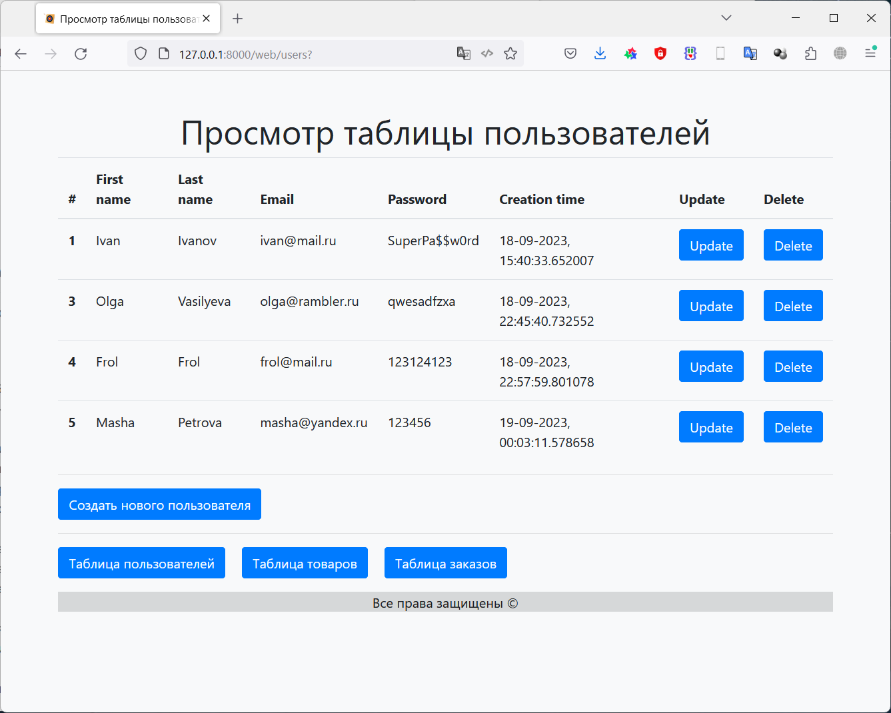
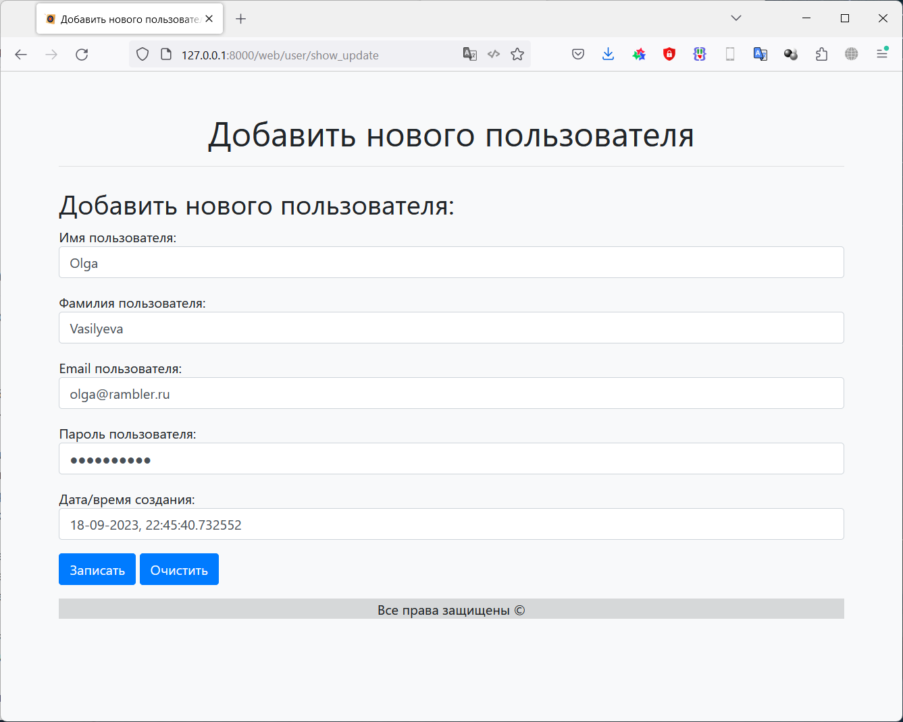
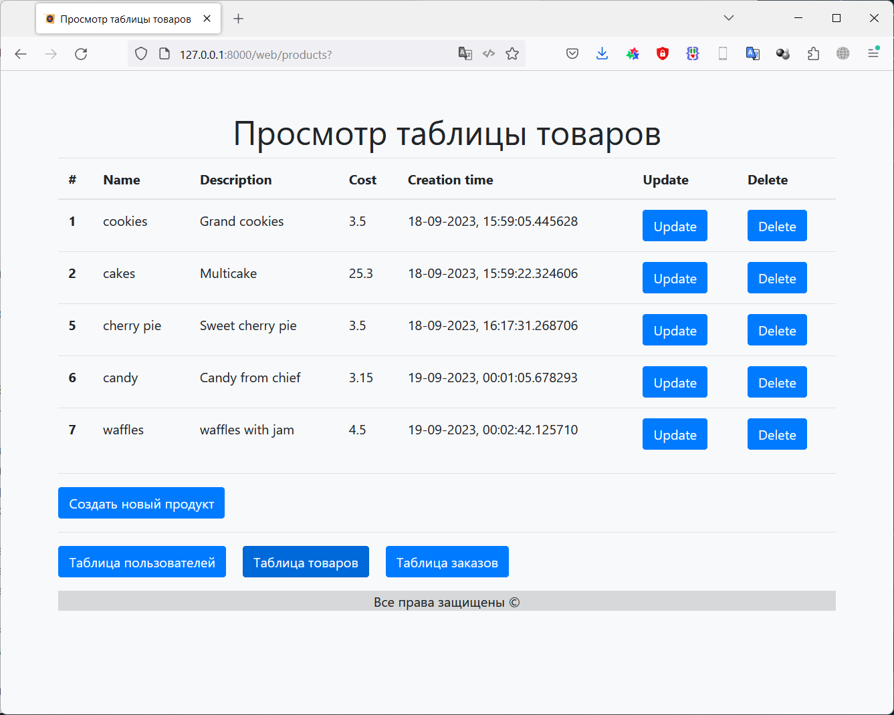
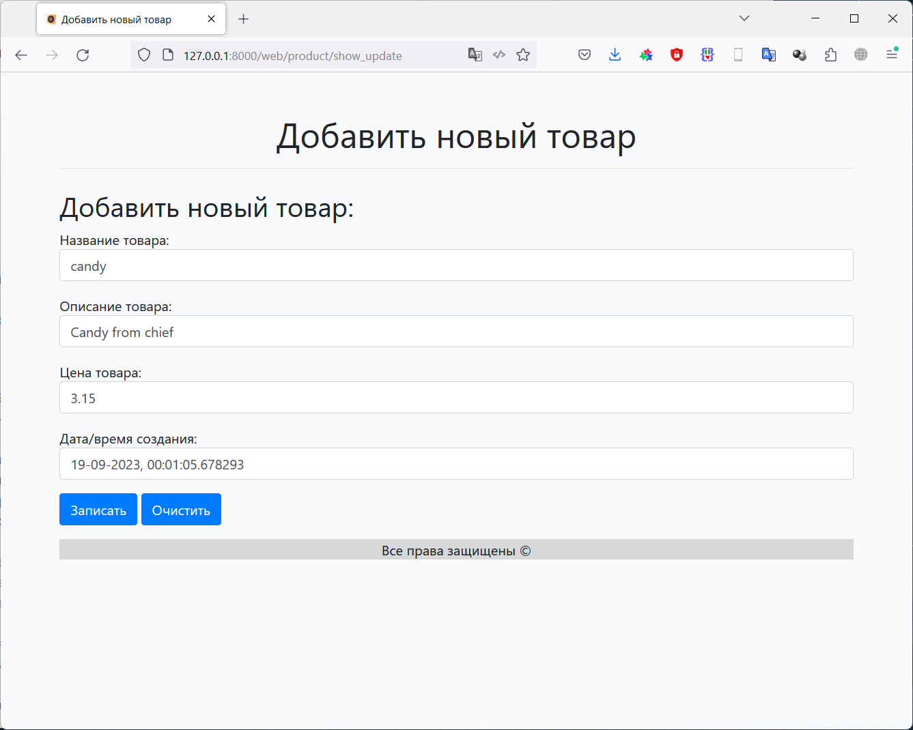
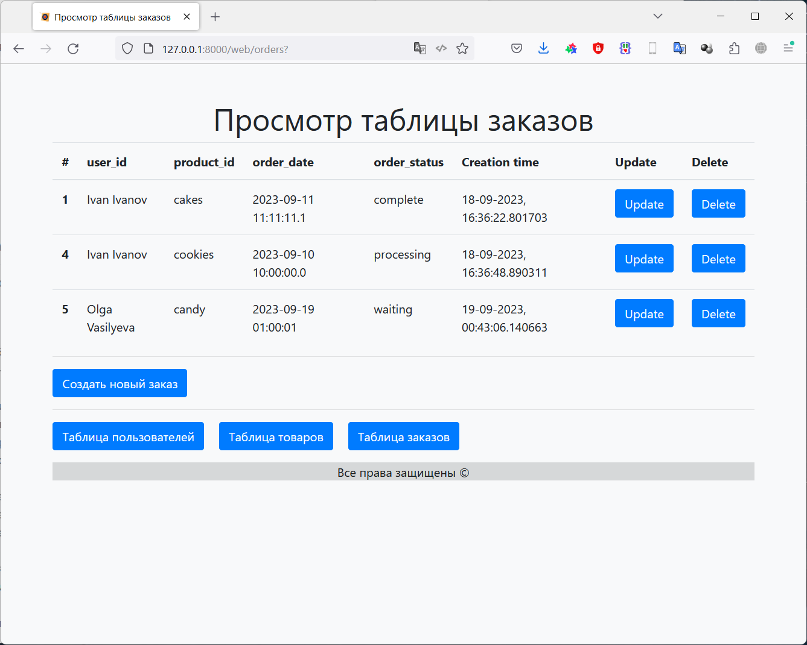
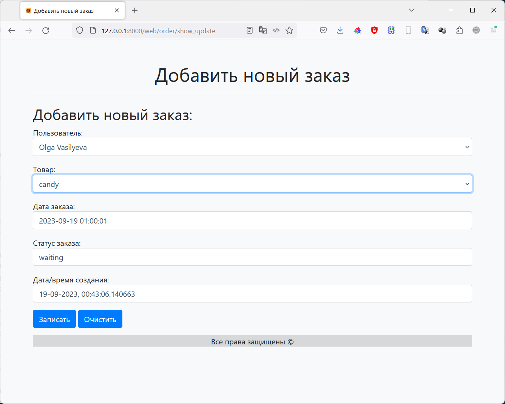

# Фреймворки Flask и FastAPI (семинары)
## Урок 6. Дополнительные возможности FastAPI

### Задание

Необходимо создать базу данных для интернет-магазина. База данных должна состоять из трёх таблиц: товары, заказы и пользователи.

- Таблица «Товары» должна содержать информацию о доступных товарах, их описаниях и ценах.
- Таблица «Заказы» должна содержать информацию о заказах, сделанных пользователями.
- Таблица «Пользователи» должна содержать информацию о зарегистрированных пользователях магазина.
- Таблица пользователей должна содержать следующие поля: id (PRIMARY KEY), имя, фамилия, адрес электронной почты и пароль.
- Таблица заказов должна содержать следующие поля: id (PRIMARY KEY), id пользователя (FOREIGN KEY), id товара (FOREIGN KEY), дата заказа и статус заказа.
- Таблица товаров должна содержать следующие поля: id (PRIMARY KEY), название, описание и цена.

Создайте модели pydantic для получения новых данных и возврата существующих в БД для каждой из трёх таблиц.
Реализуйте CRUD операции для каждой из таблиц через создание маршрутов, REST API.

**Критерии оценивания:**
- Слушатель создал базу данных для интернет-магазина. База данных должна состоять из трёх таблиц: товары, заказы и пользователи.
- Таблица «Товары» должна содержать информацию о доступных товарах, их описаниях и ценах.
- Таблица «Заказы» должна содержать информацию о заказах, сделанных пользователями.
- Таблица «Пользователи» должна содержать информацию о зарегистрированных пользователях магазина.

## Решение

Результат находится в файле main.py

В ходе работы были реализованы API методы для работы с таблицами пользователей, товаров и заказов,
реализующие CRUD операции с данными этих таблиц.

Так же был написан WEB интерфейс для работы с этими таблицами, реализующий эти же CRUD операции.

### API - интерфейс программы:
    C:\Users\User>curl -H "accept: application/json" -X GET http://127.0.0.1:8000/users/
    [{"id":1,"first_name":"Ivan","last_name":"Ivanov","email":"ivan@mail.ru","password":"SuperPa$$w0rd","created_at":"18-09-2023, 15:40:33.652007"},{"id":3,"first_name":"Olga","last_name":"Vasilyeva","email":"olga@rambler.ru","password":"qwesadfzxa","created_at":"18-09-2023, 22:45:40.732552"},{"id":4,"first_name":"Frol","last_name":"Frol","email":"frol@mail.ru","password":"123124123","created_at":"18-09-2023, 22:57:59.801078"},{"id":5,"first_name":"Masha","last_name":"Petrova","email":"masha@yandex.ru","password":"123456","created_at":"19-09-2023, 00:03:11.578658"}]
    C:\Users\User>

    C:\Users\User>curl -H "accept: application/json" -X GET http://127.0.0.1:8000/products/
    [{"id":1,"name":"cookies","description":"Grand cookies","cost":3.5,"created_at":"18-09-2023, 15:59:05.445628"},{"id":2,"name":"cakes","description":"Multicake","cost":25.3,"created_at":"18-09-2023, 15:59:22.324606"},{"id":5,"name":"cherry pie","description":"Sweet cherry pie","cost":3.5,"created_at":"18-09-2023, 16:17:31.268706"},{"id":6,"name":"candy","description":"Candy from chief","cost":3.15,"created_at":"19-09-2023, 00:01:05.678293"},{"id":7,"name":"waffles","description":"waffles with jam","cost":4.5,"created_at":"19-09-2023, 00:02:42.125710"}]
    C:\Users\User>

    C:\Users\User>curl -H "accept: application/json" -X GET http://127.0.0.1:8000/orders/
    [{"id":1,"user_id":1,"product_id":2,"order_date":"2023-09-11 11:11:11.1","order_status":"complete","created_at":"18-09-2023, 16:36:22.801703"},{"id":4,"user_id":1,"product_id":1,"order_date":"2023-09-10 10:00:00.0","order_status":"processing","created_at":"18-09-2023, 16:36:48.890311"},{"id":5,"user_id":3,"product_id":6,"order_date":"2023-09-19 01:00:01","order_status":"waiting","created_at":"19-09-2023, 00:43:06.140663"}]
    C:\Users\User>

### WEB - интерфейс программы:

#### Таблица пользователей

#### Редактирование пользователя

#### Таблица товаров

#### Редактирование товара

#### Таблица заказов

#### Редактирование заказа

